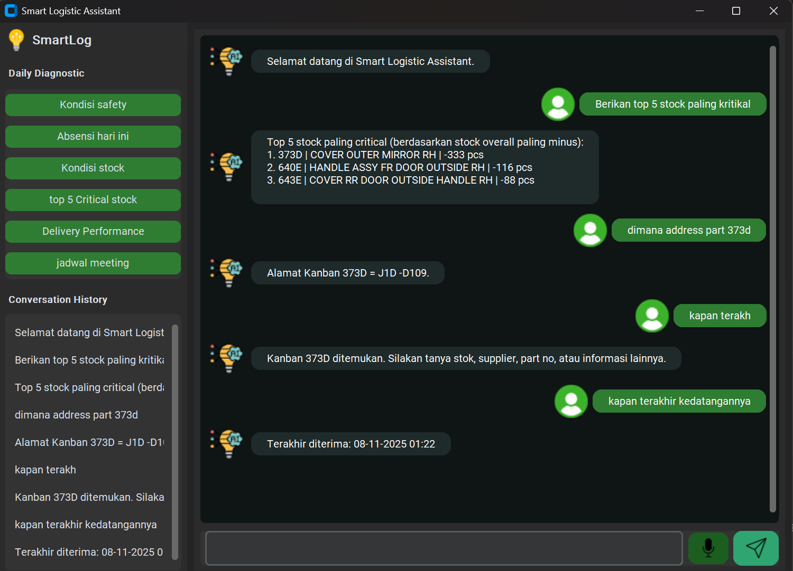
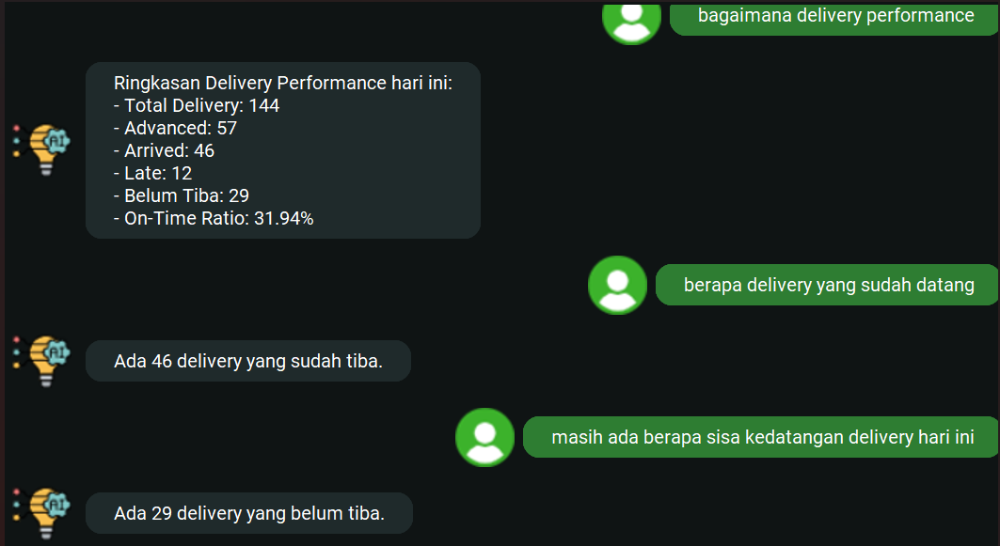

# Logistic Smart Assistant (NPL - Real-Time Stock & Delivery Monitoring)

Logistic Smart Assistant adalah aplikasi berbasis Python yang mengintegrasikan:
- **Natural Language Processing (NLP)**
- **Real-Time Delivery Monitoring (DCL Monitoring)**
- **Real-Time Stock Monitoring (Legion)**
- **CustomTkinter GUI**

Aplikasi ini dibangun khusus untuk kebutuhan area **Logistik Toyota**, di mana sangat banyak sistem terpisah (stock monitoring, DCL, SAP, report harian, planning, vanning/devaninng container, dll). Dengan hadirnya aplikasi ini, **pimpinan cukup bertanya dengan bahasa natural** untuk mendapatkan informasi real-time tanpa membuka banyak aplikasi.

---

# 📌 **Background Project**

1. **OJD Python (NLP Technology)**  
   Project ini berawal dari *On Job Development (OJD)* untuk membuat sistem NLP internal yang bisa memahami percakapan manusia dan mengembalikan data operasional secara real-time.

2. **Aplikatif Sesuai Kondisi Lapangan**  
   Di area logistik Toyota, operator & leader sering membutuhkan data cepat: status delivery, kondisi dock, stock part critical, part kosong, last received, dsb.

3. **Terlalu Banyak Aplikasi Terpisah**  
   Setiap data harus dibuka dari aplikasi berbeda:
   - DCL Monitoring
   - Stock Monitoring Overall
   - SPS Stock
   - Receiving System
   - Supplier Performance
   - Delivery Report
   - dsb…

   Logistic Smart Assistant menggabungkan **semua informasi menjadi satu pintu**, cukup bertanya:
   > “Berapa delivery yang telat?”  
   > “Route apa saja yang advanced?”  
   > “Berapa stok kanban 937F?”  
   > “Berikan top 5 stock paling kritis.”

4. **Mudah digunakan Pimpinan**  
   Dengan GUI yang modern dan voice assistant, pimpinan/operator cukup mengetik/berbicara (bisa menggunakan headset agar lebih flexible) untuk mendapatkan kondisi seputar logistic **secara real-time**.

---

# ⭐ **Fitur Utama**

### 🔹 1. **NLP Logistic Assistant**
- Menjawab pertanyaan tentang delivery:
  - Late  
  - Delay  
  - Advanced  
  - Arrived  
  - Waiting  
  - Not Arrived  
  - On-Time  
  - Route by Status  
  - Dock-specific  
  - Ringkasan Performance

- Menjawab stock kanban:
  - Stock overall  
  - SPS stock  
  - Receiving stock  
  - Stock menit & jam  
  - Supplier  
  - Part No  
  - Plant/Dock  
  - Alamat  
  - Last received  

- **Context memory**:  
  Bisa memahami pertanyaan lanjutan:  
  > “Berapa yang telat?” → “Route apa saja?”

- **Stock Critical Analyzer**  
  > “Tampilkan top 5 stock paling kritis”

---

### 🔹 2. **DCL Delivery Monitoring (JSON Parsing)**
Membaca data dari endpoint internal:
http://10.64.6.27/legion/dcl_monitoring_dock43.php

Menghitung:
- total delivery
- advanced
- arrived (on time)
- late
- delay
- waiting
- overview performance (OTR & ratio)

Mapping status sesuai Toyota Logistics:
- Arrived → On-Time arrival  
- Advanced → Early arrival  
- Late → Sudah datang tapi lewat jadwal  
- Delay → Belum datang tapi lewat jadwal  
- Waiting → Belum waktunya datang  
---

### 🔹 3. **Stock Kanban Monitoring**
Menggunakan endpoint JSON internal:
http://10.64.6.27/legion/all_data_dock43.php

- Stock overall  
  - SPS stock  
  - Receiving stock  
  - Stock menit & jam  
  - Supplier  
  - Part No  
  - Plant/Dock  
  - Alamat  
  - Last received  

Fallback CSV:
data/master_parts.csv

---
### 🔹 5. **CustomTkinter GUI Premium**
- Bubble chat animasi
- Voice assistant (TTS/WSS internal)
- Real-time data display
- Smooth message rendering
---
### 🔹 6. **Demo Preview**
Below is an example visualization of the logistic smart assistant gui :


-------


---

# 📁 **Struktur Folder**
```plaintext
logistic-smart-assistant/
│
├── assets/
│   ├── bot.png
│   ├── logo.png
│   ├── mic_rec.png
│   ├── mic.png
│   ├── send.png
│   └── user.png
│
├── data/
│   └── master_parts.csv
│
├── src/
│   ├── __pycache__/          # cache otomatis Python (boleh diabaikan)
│   │
│   ├── dcl_monitoring_json.py  # fungsi baca JSON DCL, hitung status, route, time
│   ├── gui.py                  # GUI utama customtkinter (chat window)
│   ├── nlp_logic.py            # NLP rules, intent, conversation context
│   ├── tts_manager.py          # Text-to-speech edge-tts + playsound
│   └── voice_stt.py            # (opsional) jika suatu saat mau STT kembali
│
├── venv_smartlog/              # virtual environment lokal (tidak perlu dikirim)
│
├── main.py                     # main launcher aplikasi GUI
├── README.md                   # dokumentasi proyek
├── requirements.txt            # list dependencies Python
└── .gitignore                  # file ignore untuk Git
```
---

# 🔧 **Installation & Setup**
### 1️⃣ Clone repository
```bash
git clone https://github.com/yourname/logistic-smart-assistant.git
cd logistic-smart-assistant
```
### 2️⃣ Buat virtual environment
```bash
python -m venv venv_smartlog
source venv_smartlog/bin/activate  # Linux
venv_smartlog\Scripts\activate     # Windows
```
### 3️⃣ Install dependencies
```bash
pip install -r requirements.txt
```
---

# 🚀 **Menjalankan Aplikasi**
### ▶ Jalankan GUI
```bash
python main2.py
```
---

# 🤖 **Contoh Pertanyaan yang Bisa Dijawab Assistant**

```plaintext
Delivery / DCL
“Berapa delivery yang telat?”
“Route apa saja yang advanced?”
“Berapa yang belum datang?”
“Performance hari ini bagaimana?”
“Dock 43 ada berapa delivery?”

Stock / Kanban
“Stok kanban 5011?”

“Supplier kanban 5011?”
“Berapa stok SPS kanban 8821?”
“Top 5 stock paling critical?”

Contextual memory
“Berapa yang late?”
“Route apa saja?” → tanpa menyebut status lagi
```
---

# 💡 **Roadmap Pengembangan**
```plaintext
Integrasi all system logistic :
- Legion
- e-Kanban
- Safety & Ide web log.
- Import Part System
- HR-Portal
```
---

# 👤 **Author**
```plaintext
Muis
Toyota Logistics Expertise Booth Camp 2025
Expert in NLP, Automation, Power BI, 3D Blender, Logistic System Integration
```
---

